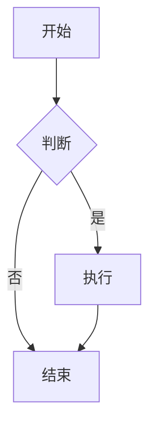

# KattyBB Markdown 编辑器 — 语法测试文档

> 本文件用于一次性验证编辑器当前支持的所有 Markdown 语法。
> 下次打开本文件即可逐项检查渲染效果，重点测试：锚点、公式、GitHub 警告框、高亮。
[TOC]

---

## 目录（锚点跳转测试）

- [标题与锚点](#标题与锚点)
- [文本基础格式](#文本基础格式)
- [链接与锚点跳转](#链接与锚点跳转)
- [列表](#列表)
- [引用](#引用)
- [代码块与高亮](#代码块与高亮)
- [表格](#表格)
- [公式 Math](#公式-math)
- [脚注](#脚注)
- [GitHub 警告框](#github-警告框)
- [分割线与其它](#分割线与其它)

---

## 标题与锚点

每个标题会自动生成 `id`（小写、非字母数字与中文的字符转为 `-`），供锚点跳转使用。

# 一级标题 H1
## 二级标题 H2
### 三级标题 H3
#### 四级标题 H4
##### 五级标题 H5
###### 六级标题 H6

> 测试要点：标题是否分级正确、是否带可点击/可定位的锚点 id。

---

## 文本基础格式

- **加粗**：这是 **粗体文本**
- *斜体*：这是 *斜体文本*
- ***加粗斜体***：这是 ***强调文本***
- ~~删除线~~：这是 ~~被删除的文本~~
- ==高亮==（重点测试项）：这是 ==被高亮的文本==，应保持 `<mark>` 样式
- 行内代码：使用 `console.log('hello')` 输出
- 下划线（HTML 标签）：<u>带下划线的文本</u>
- 混合：这是 **加粗 + ==高亮== + `代码`** 的组合

代码块内的 `==` 和 `$` 不应被当作高亮/公式处理：

```
== 这段代码里的 == 与 $x$ 不应被渲染 ==
```

---

## 链接与锚点跳转

- 外部链接：[KattyBB 官网](https://example.com)（应新窗口打开）
- 内部锚点（按 slug 跳转）：[跳到「公式 Math」章节](#公式-math)
- 带标题的内部锚点：[跳到「GitHub 警告框」](#github-警告框 "前往警告框测试")
- 引用式写法也可：[返回目录](#目录锚点跳转测试)

> 测试要点：点击锚点链接能否正确滚动定位到对应标题。

---

## 列表

### 无序列表

- 项目一
- 项目二
  - 嵌套项目 2.1
  - 嵌套项目 2.2
    - 更深嵌套 2.2.1
- 项目三

### 有序列表

1. 第一步
2. 第二步
   1. 子步骤 2.1
   2. 子步骤 2.2
3. 第三步

### 任务列表（勾选框）

- [ ] 未完成任务
- [x] 已完成任务
- [ ] 另一个待办 ==（高亮标注）==

---

## 引用

> 这是一段引用文本。
> 引用可以跨越多行。
>
> 也可以在引用内分段。

> 嵌套引用：
>
> > 内层引用内容

---

## 代码块与高亮

### 行内高亮

请执行 `npm install` 后再运行 `npm run dev`。

### JavaScript 代码块（highlight.js 语法高亮）

```javascript
function greet(name) {
  const msg = `Hello, ${name}!`;
  console.log(msg);
  return msg;
}
greet('KattyBB');
```

### Python 代码块

```python
def fib(n):
    a, b = 0, 1
    for _ in range(n):
        a, b = b, a + b
    return a

print([fib(i) for i in range(10)])
```

### Mermaid 流程图



---

## 表格

| 语法类型 | 是否支持 | 备注 |
| --- | :---: | --- |
| 加粗 | ✅ | `**text**` |
| 高亮 | ✅ | `==text==` |
| 公式 | ✅ | `$x$` / `$$x$$` |
| 警告框 | ✅ | `> [!NOTE]` |

> 测试要点：表格是否带横向滚动、对齐方式（左/中/右）是否正确。

---

## 公式 Math

### 行内公式（重点测试项）

质能方程 $E = mc^2$ 是物理学中最著名的公式之一，勾股定理可写为 $a^2 + b^2 = c^2$。

### 块级公式（重点测试项）

$$
\int_{0}^{1} x^2 \, dx = \frac{1}{3}
$$

矩阵示例：

$$
\begin{bmatrix}
a & b \\
c & d
\end{bmatrix}
\begin{bmatrix}
x \\
y
\end{bmatrix}
=
\begin{bmatrix}
ax + by \\
cx + dy
\end{bmatrix}
$$

> 测试要点：行内公式与块级公式是否都由 KaTeX 正确渲染（非纯文本）。

---

## 脚注

这是带脚注的正文示例，用于说明某个概念[^1]，也可以有第二个脚注[^note]。

[^1]: 这是第一个脚注的定义内容，验证脚注是否能正确编号并显示在文末。
[^note]: 这是带自定义 id 的脚注：GitHub 警告框与高亮均已支持。

---

## GitHub 警告框

### `> [!TYPE]` 标准格式（重点测试项，含连续多个）

> [!NOTE]
> 这是 Note 类型的提示框，用于补充说明性信息。

> [!TIP]
> 这是 Tip 类型的提示框，用于给出建议或技巧。

> [!WARNING]
> 这是 Warning 类型的提示框，用于提醒潜在风险。

> [!CAUTION]
> 这是 Caution 类型的提示框，用于强调需要谨慎的操作。

> [!IMPORTANT]
> 这是 Important 类型的提示框，用于标记关键信息。

### `> **Title**` 兼容格式

> **Note**
> 使用加粗标题写法的 Note 提示框。

> **Tip**
> 使用加粗标题写法的 Tip 提示框。

> 测试要点：五个类型是否各自独立成框（不应合并或退化为 blockquote），且夜间模式下颜色正确。

---

## 分割线与其它

上方为分割线：

---

- 自动链接：https://example.com 应可点击
- 强调符号嵌套：~~**删除并加粗**~~ 与 **_斜体加粗_**

> 测试完毕：逐项核对上述渲染效果，重点确认锚点跳转、公式、GitHub 警告框、高亮四项。

---

<!-- 文档结束 -->
