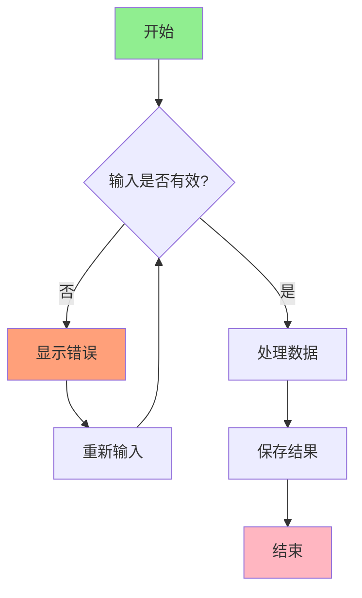
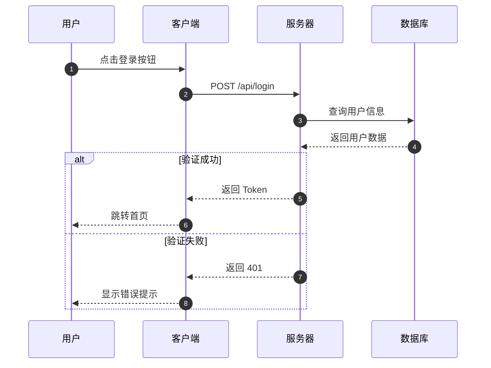
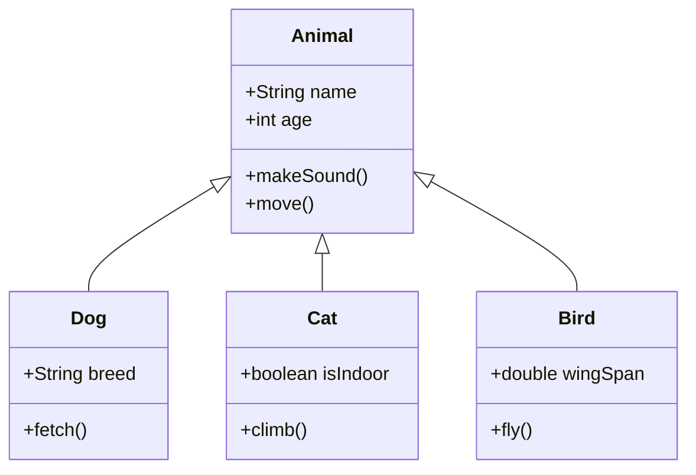
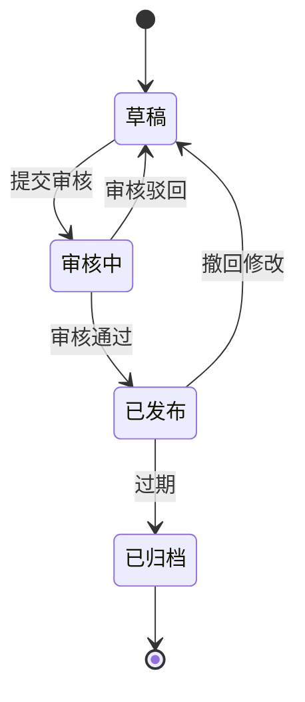
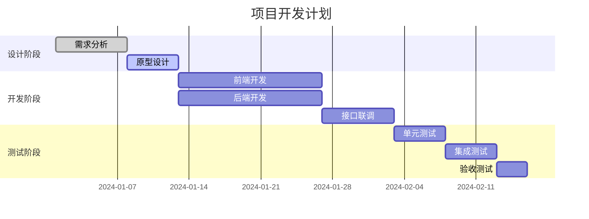
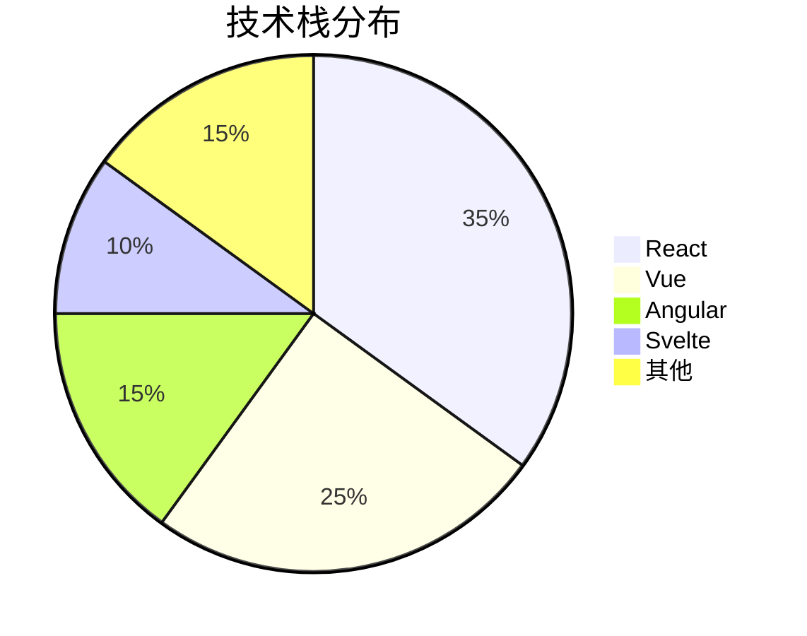

# Markdown 综合测试文档

> 这是一个用于测试 Markdown 渲染引擎的完整示例文档，涵盖了基础语法、代码块、Mermaid 图示、LaTeX 公式、HTML 标签、高亮标记及文本格式等。

---

## 一、基础语法

### 1.1 标题

Markdown 支持六级标题：

```markdown
# 一级标题
## 二级标题
### 三级标题
#### 四级标题
##### 五级标题
###### 六级标题
```

### 1.2 段落与换行

这是一个普通段落。Markdown 允许段落之间用空行分隔。

这是第二段。行末加两个空格可以实现换行。  
这是同一行的新行。

### 1.3 列表

#### 无序列表

- 第一项
- 第二项
  - 嵌套项 A
  - 嵌套项 B
- 第三项

#### 有序列表

1. 第一步：准备材料
2. 第二步：开始操作
   1. 子步骤 2.1
   2. 子步骤 2.2
3. 第三步：完成收尾

#### 任务列表

- [x] 已完成：初始化项目
- [ ] 待完成：编写文档
- [ ] 待完成：单元测试
- [x] 已完成：代码审查

### 1.4 引用块

> 这是单层引用块。
>
> > 这是嵌套引用块。
> > 可以包含 **加粗** 和 *斜体* 文本。
>
> 回到外层引用。

### 1.5 链接与图片

#### 行内链接

访问 [Moonshot AI](https://www.moonshot.cn) 了解更多信息。

#### 引用式链接

这是 [一个引用链接][ref1]，以及 [另一个引用链接][ref2]。

[ref1]: https://www.moonshot.cn "Moonshot AI 官网"
[ref2]: https://github.com "GitHub 官网"

#### 图片


#### 带标题的图片


### 1.6 表格

| 功能    | 语法       | 支持程度   |
| ------- | ---------- | ---------- |
| 标题    | `#`        | ✅ 完全支持 |
| 加粗    | `**text**` | ✅ 完全支持 |
| 表格    | `\|`       | ✅ 完全支持 |
| Mermaid | `mermaid`  | ⚠️ 部分支持 |
| LaTeX   | `$...$`    | ⚠️ 部分支持 |

> **对齐说明**：
> - 左对齐（默认）：`:---`
> - 居中对齐：`:---:`
> - 右对齐：`---:`

| 项目     | 数量 | 单价（元） |   小计（元） |
| :------- | :--: | ---------: | -----------: |
| 键盘     |  2   |     299.00 |       598.00 |
| 鼠标     |  3   |     129.50 |       388.50 |
| 显示器   |  1   |   1,299.00 |     1,299.00 |
| **合计** |      |            | **2,285.50** |

### 1.7 水平分割线

---

***

___

---

## 二、代码块

### 2.1 行内代码

使用反引号包裹行内代码：`print("Hello, World!")`、`<div>`、`npm install`。

### 2.2 围栏式代码块

#### Python

```python
def fibonacci(n):
    """返回第 n 个斐波那契数"""
    if n <= 1:
        return n
    a, b = 0, 1
    for _ in range(2, n + 1):
        a, b = b, a + b
    return b

# 测试
for i in range(10):
    print(f"F({i}) = {fibonacci(i)}")
```

#### JavaScript

```javascript
// 异步获取用户数据
async function fetchUserData(userId) {
    try {
        const response = await fetch(`/api/users/${userId}`);
        if (!response.ok) {
            throw new Error(`HTTP error! status: ${response.status}`);
        }
        const data = await response.json();
        return data;
    } catch (error) {
        console.error('获取用户数据失败:', error);
        return null;
    }
}

// 使用示例
fetchUserData(42).then(user => {
    console.log(user?.name ?? '未知用户');
});
```

#### Bash / Shell

```bash
#!/bin/bash
# 批量重命名脚本

for file in *.txt; do
    if [ -f "$file" ]; then
        newname="backup_$(date +%Y%m%d)_${file}"
        mv "$file" "$newname"
        echo "已重命名: $file -> $newname"
    fi
done

echo "处理完成，共处理 $(ls backup_*.txt 2>/dev/null | wc -l) 个文件"
```

#### JSON

```json
{
    "project": "Markdown Test",
    "version": "1.0.0",
    "dependencies": {
        "marked": "^9.0.0",
        "mermaid": "^10.0.0",
        "katex": "^0.16.0"
    },
    "scripts": {
        "build": "node build.js",
        "test": "jest"
    },
    "authors": [
        "Alice",
        "Bob"
    ]
}
```

#### Diff

```diff
  function calculate(x, y) {
-     return x + y;
+     return x * y;
  }
```

### 2.3 代码块中的转义

```markdown
这是代码块中的反引号：\`\`\`
这是代码块中的星号：\*\*加粗\*\*
```

---

## 三、Mermaid 图示

### 3.1 流程图



### 3.2 时序图



### 3.3 类图



### 3.4 状态图



### 3.5 甘特图



### 3.6 饼图



---

## 四、LaTeX 数学公式

### 4.1 行内公式

爱因斯坦的质能方程 $E = mc^2$ 揭示了质量与能量的等价关系。

一元二次方程的求根公式为 $x = \\frac{-b \\pm \\sqrt{b^2 - 4ac}}{2a}$。

### 4.2 独立公式块

#### 二次方程求根公式

$$
x = \\frac{-b \\pm \\sqrt{b^2 - 4ac}}{2a}
$$

#### 三角恒等式

$$
\\sin^2\\theta + \\cos^2\\theta = 1
$$

#### 定积分

$$
\\int_{a}^{b} f(x) \\, dx = F(b) - F(a)
$$

#### 矩阵

$$
A = \\begin{bmatrix}
a_{11} & a_{12} & a_{13} \\\\
a_{21} & a_{22} & a_{23} \\\\
a_{31} & a_{32} & a_{33}
\\end{bmatrix}
$$

#### 多行对齐公式

$$
\\begin{aligned}
\\nabla \\cdot \\mathbf{E} &= \\frac{\\rho}{\\varepsilon_0} \\\\
\\nabla \\times \\mathbf{E} &= -\\frac{\\partial \\mathbf{B}}{\\partial t} \\\\
\\nabla \\cdot \\mathbf{B} &= 0 \\\\
\\nabla \\times \\mathbf{B} &= \\mu_0 \\mathbf{J} + \\mu_0 \\varepsilon_0 \\frac{\\partial \\mathbf{E}}{\\partial t}
\\end{aligned}
$$

#### 求和与极限

$$
\\sum_{i=1}^{n} i = \\frac{n(n+1)}{2} \\quad \\text{且} \\quad \\lim_{x \\to 0} \\frac{\\sin x}{x} = 1
$$

#### 分段函数

$$
f(x) = \\begin{cases}
x^2 & \\text{if } x \\geq 0 \\\\
-x^2 & \\text{if } x < 0
\\end{cases}
$$

---

## 五、HTML 标签

### 5.1 基础 HTML 元素

Markdown 中可以直接嵌入 HTML 标签。

#### 折叠详情块

<details>
<summary>点击展开：项目配置说明</summary>
这是一个可折叠的详情块，适合放置冗长的配置说明。
- **环境变量**：`NODE_ENV=production`
- **端口**：默认 `3000`
- **数据库**：PostgreSQL 14+
</details>

#### 下标与上标

水的化学式是 H<sub>2</sub>O，面积单位是 m<sup>2</sup>。

#### 键盘按键

按下 <kbd>Ctrl</kbd> + <kbd>C</kbd> 复制，<kbd>Ctrl</kbd> + <kbd>V</kbd> 粘贴。

#### 标记文本

<mark>这段文字被高亮标记</mark>，用于强调重要内容。

### 5.2 自定义样式

<p style="color: #e74c3c; font-size: 18px; font-weight: bold;">
  这是一段自定义样式的红色加粗文字。
</p>

<center>
  <p>这段文字居中显示</p>
</center>

### 5.3 嵌入 iframe（部分渲染器支持）

<iframe src="https://www.moonshot.cn" width="100%" height="300" style="border:1px solid #ccc; border-radius:8px;"></iframe>

### 5.4 注释

<!-- 这是一个 HTML 注释，在渲染结果中不可见 -->

---

## 六、高亮标记

### 6.1 双等号高亮

这是 ==高亮标记== 的示例文本。

在 Markdown 扩展语法中，==双等号== 可以用来 ==高亮显示== 重要内容。

- ==关键步骤==：务必检查配置
- ==注意事项==：生产环境请谨慎操作
- ==截止日期==：2024年12月31日

### 6.2 与其他格式组合

- **==加粗且高亮==**
- *==斜体且高亮==*
- `==行内代码且高亮==`
- [==链接且高亮==](https://example.com)

---

## 七、文本格式

### 7.1 基础格式

| 格式         | 语法                     | 效果                     |
| ------------ | ------------------------ | ------------------------ |
| 加粗         | `**文字**` 或 `__文字__` | **这是加粗文字**         |
| 斜体         | `*文字*` 或 `_文字_`     | *这是斜体文字*           |
| 删除线       | `~~文字~~`               | ~~这是删除线文字~~       |
| 下划线       | `<u>文字</u>`            | <u>这是下划线文字</u>    |
| 粗斜体       | `***文字***`             | ***这是粗斜体文字***     |
| 粗体加删除线 | `~~**文字**~~`           | ~~**这是粗体加删除线**~~ |

### 7.2 格式组合示例

这是一段包含多种格式的文本：

> 请务必 **仔细阅读** 以下 <u>重要说明</u>，并 ~~忽略过时的内容~~。对于 *==关键配置项==*，请确保 ***已正确设置***。

### 7.3 转义字符

当需要显示 Markdown 特殊字符时，可以使用反斜杠转义：

- \\* 星号
- \\# 井号
- \\[ 左方括号
- \\` 反引号
- \\| 竖线

---

## 八、脚注

Markdown 支持脚注功能[^1]。

这是一个带脚注的句子[^2]，以及另一个脚注[^3]。

[^1]: 这是第一个脚注的内容。
[^2]: 脚注可以包含 `代码` 和 **格式**。
[^3]: 脚注支持多行内容。
    这是脚注的续行。

---

## 九、定义列表

术语 1
:   这是术语 1 的定义说明。

术语 2
:   这是术语 2 的第一段定义。
:   这是术语 2 的第二段定义。

---

## 十、结语

本文档涵盖了 Markdown 的主要语法和扩展功能，包括：

1. ✅ 基础语法（标题、列表、表格、链接等）
2. ✅ 代码块（多种语言高亮）
3. ✅ Mermaid 图示（流程图、时序图、类图等）
4. ✅ LaTeX 数学公式
5. ✅ HTML 标签嵌入
6. ✅ ==高亮标记==
7. ✅ 下划线、加粗、斜体、删除线等文本格式

> **提示**：不同 Markdown 渲染器对扩展语法的支持程度可能有所不同，请根据实际使用环境调整。