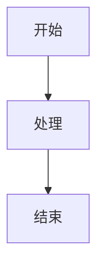

# KattyBB Markdown Editor

一个优雅、功能丰富的 Markdown 编辑器，支持多种精美主题、实时预览、同步滚动、Mermaid 图表渲染以及多种格式导出。

## 功能特性

### 核心功能
- **实时预览**：编辑 Markdown 的同时即时查看渲染效果
- **三种显示模式**：
  - 仅编辑窗口
  - 编辑窗口 + 渲染窗口（默认）
  - 仅渲染窗口
- **同步滚动**：编辑器和渲染窗口根据标题自动对齐滚动，支持开启/关闭
- **YAML Front Matter 隐藏**：渲染时自动隐藏 YAML 元数据，不直接显示

### Markdown 扩展
- **目录支持**：使用 `[TOC]` 自动生成文档目录
- **高亮语法**：使用 `==高亮内容==` 实现文本高亮
- **Mermaid 图表**：支持流程图、时序图、类图、甘特图等多种 Mermaid 图表
- **标准 Markdown**：完整支持标题、列表、引用、表格、代码块、链接、图片等

### 主题系统
支持多种精美主题，每种主题都有日间和夜间模式：
- **Bloom Petal**（默认）
- **Animal Island**
- **Everforest**
- 以及更多...

主题切换自动匹配文件：`xxx.css` 为日间模式，`xxx-dark.css` 为对应的夜间模式。

### 悬浮目录
当文档存在目录时，渲染窗口右上角会出现半透明悬浮按钮，点击可展开目录，支持滚动跟随，点击跳转到对应位置。

### 导出功能
所有导出格式均保持与当前预览主题一致：
- **导出 HTML**：所见即所得，完整保留当前主题样式
- **打印 PDF**：使用浏览器打印功能，主题样式完整保留
- **导出 Word (.doc)**：Mermaid 图表自动转换为 PNG 图片，表格和代码块样式完整保留
- **保存 Markdown (.md)**：保留原始 Markdown 源码

## 快速开始

### 本地使用
1. 克隆或下载本项目到本地
2. 用浏览器打开 `index.html` 文件
3. 开始编辑 Markdown 内容

### 部署到 GitHub Pages
1. 将项目推送到 GitHub 仓库
2. 在仓库设置中启用 GitHub Pages
3. 访问分配的 URL 即可在线使用

## 使用指南

### 编辑与预览
- 在左侧编辑器中输入 Markdown 语法
- 右侧实时显示渲染效果
- 点击工具栏按钮切换三种显示模式

### 同步滚动
- 默认开启，滚动编辑器时渲染窗口自动跟随
- 以标题为对齐基准，方便定位源码位置
- 点击工具栏同步滚动按钮可关闭/开启

### 主题切换
- 点击左上角主题选择下拉菜单
- 选择喜欢的主题和日间/夜间模式
- 所有样式（包括导出）都会自动适配

### 目录与导航
- 在文档中任意位置插入 `[TOC]` 生成目录
- 渲染窗口右上角出现悬浮目录按钮
- 点击按钮展开目录，点击条目跳转定位

### Mermaid 图表
在代码块中指定 `mermaid` 语言：



支持所有 Mermaid 图表类型：flowchart、sequenceDiagram、classDiagram、stateDiagram、gantt 等。

### 文件命名规则
导出时文件名自动遵循以下规则：
1. 如果文件是从本地打开的，导出文件名与原文件一致
2. 如果是未命名文件，自动获取 Markdown 中的第一个一级标题（`# 标题`）作为文件名；如果不存在一级标题，则使用二级标题，以此类推

## 导出注意事项

### HTML 导出
- 完整保留当前主题的所有样式
- 代码块显示样式与预览窗口一致
- 引用块、表格等样式完整保留

### Word 导出
- Mermaid 图表自动转换为高清 PNG 图片
- 表格使用实色边框，确保在 Word 中正确显示
- 代码块显示为带边框的样式块
- 使用 `.doc` 格式以确保 Word 能正确识别 HTML 内容

### PDF 导出
- 使用浏览器打印功能生成 PDF
- 建议在打印设置中选择"另存为 PDF"
- 主题样式完整保留

## 浏览器兼容性
- Chrome / Edge（推荐）
- Firefox
- Safari

## 技术栈
- 原生 HTML5 / CSS3 / JavaScript
- [Marked.js](https://marked.js.org/) — Markdown 解析
- [Mermaid.js](https://mermaid.js.org/) — 图表渲染
- [KaTeX](https://katex.org/) — 数学公式（可选）

## 目录结构

```
KattyBB_MD_Editor/
├── index.html          # 主程序入口
├── bloom-petal.css     # Bloom Petal 日间主题
├── bloom-petal-dark.css # Bloom Petal 夜间主题
├── animal-island.css   # Animal Island 日间主题
├── animal-island-dark.css # Animal Island 夜间主题
├── everforest-light.css # Everforest 日间主题
├── everforest-dark.css  # Everforest 夜间主题
├── Markdown.svg        # 编辑器图标
└── README.md           # 本文件
```

## 常见问题

**Q: 导出 Word 时 Mermaid 图表显示为文字？**
A: 确保图表在预览窗口中已正确渲染（显示为图形而非错误提示），然后重试导出。如果图表包含语法错误，导出时会降级为代码块显示。

**Q: 在 GitHub Pages 上导出与本地不一致？**
A: 确保所有资源文件已正确上传到仓库，且 GitHub Pages 已完全部署。首次部署后可能需要等待几分钟让 CDN 缓存更新。

**Q: 同步滚动不准确？**
A: 同步滚动以标题为对齐基准，如果文档结构复杂（大量嵌套列表、表格等），可能无法完美对齐。可关闭同步滚动后手动调整。

**Q: 如何添加自定义主题？**
A: 创建 `xxx.css`（日间）和 `xxx-dark.css`（夜间）文件，遵循现有主题的 CSS 变量命名规范，然后在 `index.html` 的主题配置中注册即可。

## 更新日志

### 当前版本
- 优化导出功能，确保所有格式与当前主题一致
- 修复 Mermaid 图表导出到 Word 的兼容性问题
- 改进同步滚动算法，基于标题对齐
- 添加悬浮目录功能
- 支持 YAML Front Matter 隐藏
- 完善代码块样式（三色圆点装饰）
- 修复各主题下的表格、引用块、目录等样式一致性

---

**KattyBB Markdown Editor** — 让 Markdown 编辑成为一种享受。
